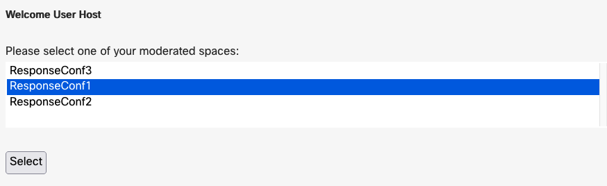

# GVE Devnet Webex Incident Response Meeting Rooms
This prototype provides a custom web interface for quickly building incident response team spaces with regular Webex user members 
and "phone only" members that are invited to join via SMS or voice call using Webex Connect (IMI Mobile)

## Contacts
* Gerardo Chaves (gchaves@cisco.com)

## Solution Components
* Webex Messaging
* Webex Meetings
* Webex Connect

## Coding Guides used
 
Downgrading the requests-oauthlib library to version 0.0.0 to avoid the OAuth error I was getting:
https://github.com/requests/requests-oauthlib/issues/324

Example Oauth with Webex Teams:
https://github.com/CiscoDevNet/webex-teams-auth-sample

Walkthrough including how to refresh tokens:
https://developer.webex.com/blog/real-world-walkthrough-of-building-an-oauth-webex-integration

## Related Sandbox Environment  

This sample code can be tested using any Cisco Webex organization and a Webex Connect account or sandbox 
that can be obtained here: https://sandbox.imiconnect.io/

## Installation/Configuration  

First, you need to create a webex integration in your organization to be able to authenticate users with the sample 
applications so that it can access and edit the various spaces for which the user is a moderator. 

Follow the instructions in the [Webex Integrations](https://developer.webex.com/docs/integrations) documentation to create
an integration with the following scopes: spark:all, meetings:recordings_read, meetings:recordings_write, meetings:controls_read,
meetings:controls_write, meetings:participants_read, meetings:participants_write, spark-admin:people_read, 
spark-admin:telephony_config_read, spark-admin:organizations_read , spark-admin:roles_read

You might want to use the following for the redirect URI in the integration to match de defaults in the sample code:  
http://0.0.0.0:5500/callback  

Clone this repository with `git clone [repository name]`  or you can just download the files with the "Download Zip" 
option within the green Code dropdown button and unzip them in a local directory.  

Set up a Python virtual environment. Make sure Python 3 is installed in your environment, and if not, 
you may download Python [here](https://www.python.org/downloads/).  

Once Python 3 is installed in your environment, you can activate the virtual environment with 
the instructions found [here](https://docs.python.org/3/tutorial/venv.html).  

Install the sample code requirements with `pip3 install -r requirements.txt`  

Now edit the .env file to fill out  the following configuration variables:  

**CLIENT_ID**     
Set this variable to the Client ID from your integration. 

**CLIENT_SECRET**  
Set this variable to the Client Secret from your integration.  

**IMI_SERVICE_KEY**  
Copy the Webex Connect (IMI) Service key for your account or sandbox here.  

**SMS_ORIGIN**  
Specify the originating Webex Connect phone number for sending SMS here  

**VOICE_ORIGIN**
Specify the originating Webex Connect phone number for making notification voice calls here

**INT_PHONE_TYPE_SMS**  
Specify type of phone number from the directory (if any) of internal responders to use for sending SMS messages. Current   
options as per the Webex REST API /people/get-person-details endpoint (https://developer.webex.com/docs/api/v1/people/get-person-details) 
are: 'mobile', 'work' or 'fax' . Only the first number of that type pulled from the directory will be used. 

**INT_PHONE_TYPE_VOICE**  
Specify type of phone number from the directory (if any) of internal responders to use for sending voice call notifications. Current   
options as per the Webex REST API /people/get-person-details endpoint (https://developer.webex.com/docs/api/v1/people/get-person-details) 
are: 'mobile', 'work' or 'fax' . Only the first number of that type pulled from the directory will be used. 

Also, in the server.py file, configure the following variable:

**PUBLIC_URL**
Set PUBLIC_URL to the URL where your instance of this Flask application will run. If you do not change the parameters 
of app.run() at the end of the server.py file, this should be the same value of 'http://0.0.0.0:5500' that is set by default 
in the sample code.  
NOTE: This URL does not actually have to map to a public IP address out on the internet. 

### Webex Spaces and team setup  
  
To use this sample, all users that want to be able to manage incident response conferences must be moderators of the Webex Spaces (rooms) that will 
be used to host the online meetings and contain users. You can select existing spaces with members already in the space, the sample code will 
consolidate those users with it's own database so that when you edit it within the web interface consistency is maintained.  

### Internal database  
This sample manages it's data using SQLLite for which it creates a file named 'incident_esp_db.sqlite3' in the same directory where 
the sample code resides. If you wish to re-initialize the database, you can simple stop the sample, delete the file, and start again. 
This might be useful to purge the external incident responders list since, at the moment, there is no mechanism to delete members from 
that list. You can also use a third party editor of DBLite files to edit the tables manually; table dependencies are built into the 
database schema so there is no danger of leaving the DB in an erroneous state and you can always just delete the file if this happens, 
the sample will reconstruct the list of users that belong to spaces from what it sees in Webex itself; only the external incident responder 
data will be lost if you delete the DN file.  

## Usage

    $ python server.py

Once the flask app is running,  a user with the role of Webex Admin for the organization has to use a web browser to 
log into the /admin_login route (typically http://0.0.0.0:5500/admin_login) so that the code can generate a tokens.json file that 
is stored in the same local directory where the flask application is running so that the entire list of corporate users can be listed 
in the applications "internal responders" list.  
If you attempt to use the application without this step, you will be redirected to a page that prompts you to do so and provides the correct URL. 
Once this requirement is satisfied, you will be re-directed to a page that prompts you  
to have a regular user that is a moderator of spaces log into the regular initial route (typically http://0.0.0.0:5500)

NOTE: You only have to use the organization admin credentials to log into /admin_login once to generate the tokens.json file. As long 
as the application is used at least once in a 3 month period, the code will refresh the token as needed. If the file is deleted or 
it expires beyond refresh , the application with just prompt you to have the admin log in.
Be sure to clear out the **tokens.json** file when you are done using the sample so you do not leave unsecured token credentials in some 
test server. When creating production code using this sample as a reference, be sure to store in a more secure manner and fully encrypted. 

Once a moderator is authenticated, you will be presented with a list of spaces for which you are a moderator:

  

Select the space where you want to create/edit an incident and click on the "Select" button.  
  

You will now be presented with the main Incident Response Conference page where you can do the following:  

  

- Add Webex User incident responders from the list of all members of the organization. You can filter the list by entering at least the 
first 3 characters of the Full Name of the person you are looking for in the search bar and pressing Enter. 
Press Enter on an empty search field to return to the full directory. 
- Add external incident responders from a list that you can add members to. These are not Webex Users but need to have a least a name and either a mobile number 
or a voice number. 
- Remove incident responders from the space
- Toggle notification mechanism for each responder in the space by hovering over the row with their name. You can click on the SMS or Phone icon 
to toggle using that as a mechanism no notifying the (Phone icon means it will place a voice call to remind them)
- Start an incident response conference. This opens a new tab in the browser you are using and redirects you to a page that 
lets you start the meeting using an installed Webex App.  It also triggers a back end process in the sample code that will send the
 join information to all members of the incident response space via Webex Message and all of those external responders that are not 
Webex Users will recive an SMS message sent to their mobile number and, if a voice only number is configured, they will receive a call 
that will spell out the meeting number and phone number to call using text to speech.  
- Send a reminder notification to individual responders in the space by overing the mouse cursor above the row for the responder in the list 
and clicking on the blue paper airplane icon to re-send an invitation. Don't forget to toggle SMS or Phone icons as needed if you want to modify 
how they are being notified. By default, if the responder is internal or external with an email address, the application will also send them a 
Webex message. 
- Stop an incident response conference by removing all members of the space which kicks them off of the response conference. It also clears 
the name of the incident
- You can return to the list of spaces for which you are a moderator by clicking on the "Done" button.  

### LICENSE

Provided under Cisco Sample Code License, for details see [LICENSE](LICENSE.md)

### CODE_OF_CONDUCT

Our code of conduct is available [here](CODE_OF_CONDUCT.md)

### CONTRIBUTING

See our contributing guidelines [here](CONTRIBUTING.md)

#### DISCLAIMER:
<b>Please note:</b> This script is meant for demo purposes only. All tools/ scripts in this repo are released for use "AS IS" without any warranties of any kind, including, but not limited to their installation, use, or performance. Any use of these scripts and tools is at your own risk. There is no guarantee that they have been through thorough testing in a comparable environment and we are not responsible for any damage or data loss incurred with their use.
You are responsible for reviewing and testing any scripts you run thoroughly before use in any non-testing environment.