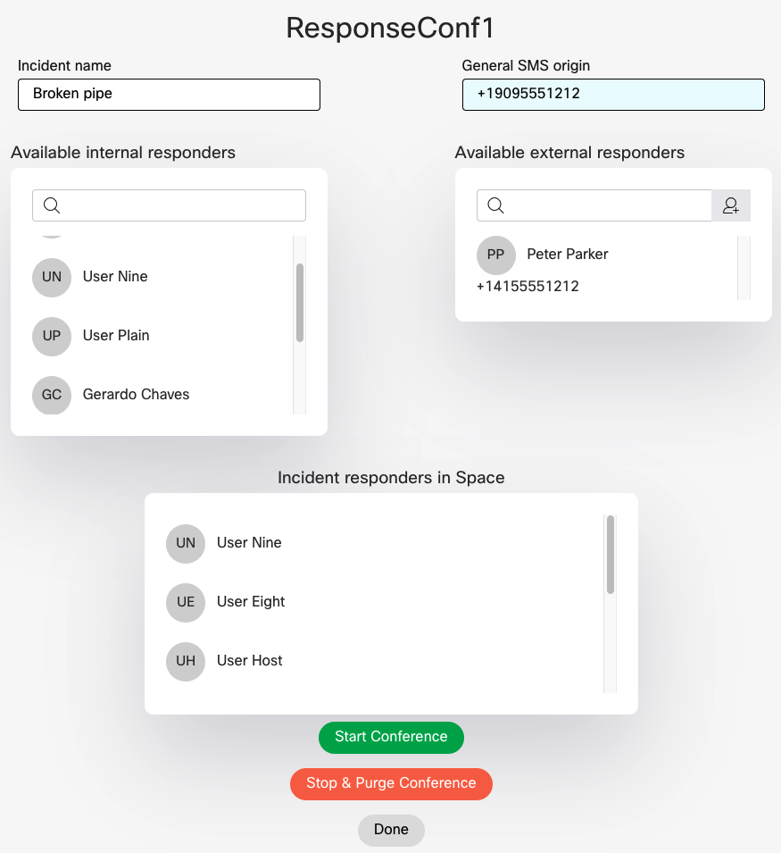

# GVE Devnet Webex Incident Response Meeting Rooms
This prototype provides a custom web interface for quickly building incident response team spaces with regular Webex user members 
and "phone only" members that are invited to join via SMS or voice call using Webex Connect (IMI Mobile)

## Contacts
* Gerardo Chaves (gchaves@cisco.com)

## Solution Components
* Webex Messaging
* Webex Meetings
* Webex Connect

## Coding Guides used
 
Downgrading the requests-oauthlib library to version 0.0.0 to avoid the OAuth error I was getting:
https://github.com/requests/requests-oauthlib/issues/324

Example Oauth with Webex Teams:
https://github.com/CiscoDevNet/webex-teams-auth-sample

Walkthrough including how to refresh tokens:
https://developer.webex.com/blog/real-world-walkthrough-of-building-an-oauth-webex-integration

## Related Sandbox Environment  

This sample code can be tested using any Cisco Webex organization and a Webex Connect account or sandbox 
that can be obtained here: https://sandbox.imiconnect.io/

## Installation/Configuration  

First, you need to create a webex integration in your organization to be able to authenticate users with the sample 
applications so that it can access and edit the various spaces for which the user is a moderator. 

Follow the instructions in the [Webex Integrations](https://developer.webex.com/docs/integrations) documentation to create
an integration with the following scopes: spark:all, meetings:recordings_read, meetings:recordings_write, meetings:controls_read,
meetings:controls_write, meetings:participants_read, meetings:participants_write   

You might want to use the following for the redirect URI in the integration to match de defaults in the sample code:  
http://0.0.0.0:5500/callback  

Clone this repository with `git clone [repository name]`  or you can just download the files with the "Download Zip" 
option within the green Code dropdown button and unzip them in a local directory.  

Set up a Python virtual environment. Make sure Python 3 is installed in your environment, and if not, 
you may download Python [here](https://www.python.org/downloads/).  

Once Python 3 is installed in your environment, you can activate the virtual environment with 
the instructions found [here](https://docs.python.org/3/tutorial/venv.html).  

Install the sample code requirements with `pip3 install -r requirements.txt`  

Now edit the .env file to fill out  the following configuration variables:  

**CLIENT_ID**     
Set this variable to the Client ID from your integration. 

**CLIENT_SECRET**  
Set this variable to the Client Secret from your integration.  

**IMI_SERVICE_KEY**  
Copy the Webex Connect (IMI) Service key for your account or sandbox here.  

**SMS_ORIGIN**  
Specify the originating Webex Connect phone number for sending SMS here  

**TEAM_NAME** 
Specify name of Webex Team from which to obtain members to offer as available responders 

Also, in the server.py file, configure the following variable:

**PUBLIC_URL**
Set PUBLIC_URL to the URL where your instance of this Flask application will run. If you do not change the parameters 
of app.run() at the end of the server.py file, this should be the same value of 'http://0.0.0.0:5500' that is set by default 
in the sample code.  
NOTE: This URL does not actually have to map to a public IP address out on the internet. 

### Webex Spaces and team setup  
  
To use this sample, all users that want to be able to manage incident response conferences must be moderators of the Webex Spaces (rooms) that will 
be used to host the online meetings and contain users. You can select existing spaces with members alredy in the space, the sample code will 
consolidate those users with it's own database so that when you edit it within the web interface consistency is maintained.  

You also need to create a Webex Team where you are a moderator and you add as members all Webex Users inside or outside of your organization 
that you wish to be able to add to the incident response spaces. Use the name of this team as the alue for the **TEAM_NAME** variable described 
above.  
Do not add the Spaces themselves to the Team, just the potential members. 
You can add all members of your organization if you wish. The intention of this Team is to allow the user of the sample code the ability to  
list all potential responders without having the privileges to list all users in the organization. It also allows you to add  Webex users 
that are not part of your organization but that you frequently add as responders. 

### Internal database  
This sample manages it's data using SQLLite for which it creates a file named 'incident_esp_db.sqlite3' in the same directory where 
the sample code resides. If you wish to re-initialize the database, you can simple stop the sample, delete the file, and start again. 
This might be useful to purge the external incident responders list since, at the moment, there is no mechanism to delete members from 
that list. You can also use a third party editor of DBLite files to edit the tables manually; table dependencies are built into the 
database schema so there is no danger of leaving the DB in an erroneous state and you can always just delete the file if this happens, 
the sample will reconstruct the list of users that belong to spaces from what it sees in Webex itself; only the external incident responder 
data will be lost if you delete the DN file.  

## Usage

    $ python server.py

Once the flask app is running, use a browser to go to the value you used for PUBLIC_URL (typically http://0.0.0.0:5500) which will re-direct to a Webex Teams 
authentication page if the first time using it so you can log in using your Webex Teams account credentials. 

Once authenticated, you will be presented with a list of spaces for which you are a moderator:

  

Select the space where you want to create/edit an incident and click on the "Select" button.  
  

You will now be presented with the main Incident Response Conference page where you can do the following:  

  

- Add Webex User incident responders from the list of members of the team matching the name specified in the **TEAM_NAME** environmental variable
- Add external incident responders from a list that you can add members to. These are not Webex Users but need to have a least a name and either a mobile number 
or a voice number. 
- Remove incident responders from the space
- Start an incident response conference. This opens a new tab in the browser you are using and redirects you to a page that 
lets you start the meeting using an installed Webex App.  It also triggers a back end process in the sample code that will send the
 join information to all members of the incident response space via Webex Message and all of those external responders that are not 
Webex Users will recive an SMS message sent to their mobile number and, if a voice only number is configured, they will receive a call 
that will spell out the meeting number and phone number to call using text to speech.  
- Stop an incident response conference by removing all members of the space which kicks them off of the response conference. It also clears 
the name of the incident
- You can return to the list of spaces for which you are a moderator by clicking on the "Done" button.  

### LICENSE

Provided under Cisco Sample Code License, for details see [LICENSE](LICENSE.md)

### CODE_OF_CONDUCT

Our code of conduct is available [here](CODE_OF_CONDUCT.md)

### CONTRIBUTING

See our contributing guidelines [here](CONTRIBUTING.md)

#### DISCLAIMER:
<b>Please note:</b> This script is meant for demo purposes only. All tools/ scripts in this repo are released for use "AS IS" without any warranties of any kind, including, but not limited to their installation, use, or performance. Any use of these scripts and tools is at your own risk. There is no guarantee that they have been through thorough testing in a comparable environment and we are not responsible for any damage or data loss incurred with their use.
You are responsible for reviewing and testing any scripts you run thoroughly before use in any non-testing environment.